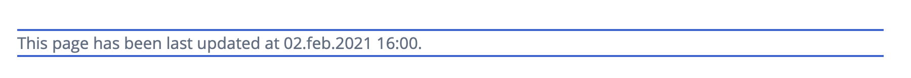
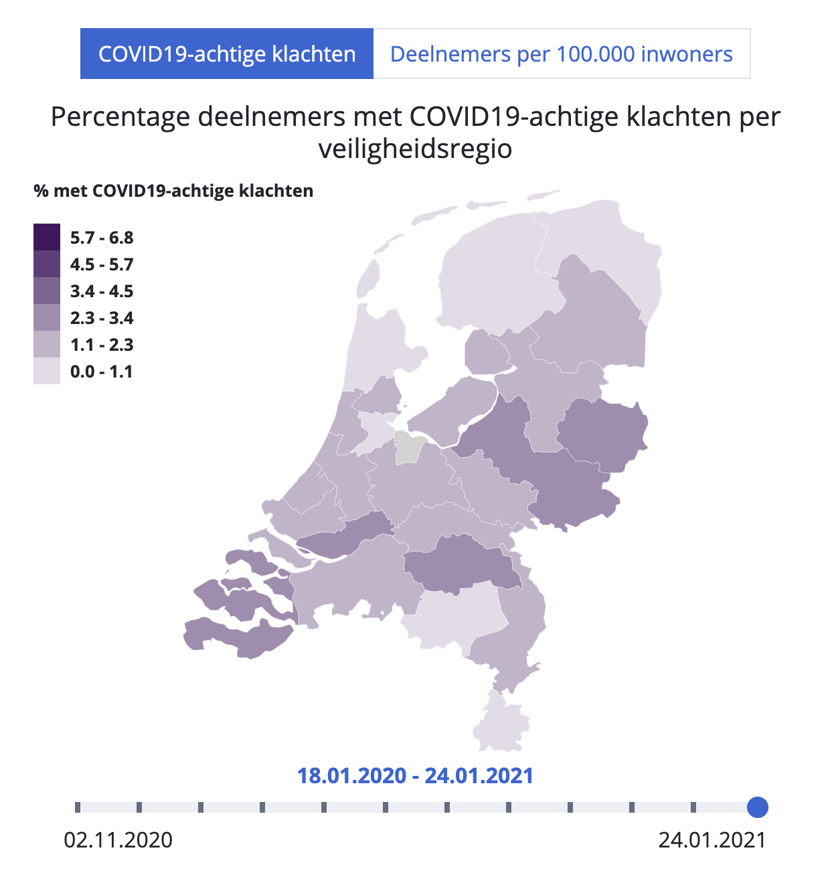
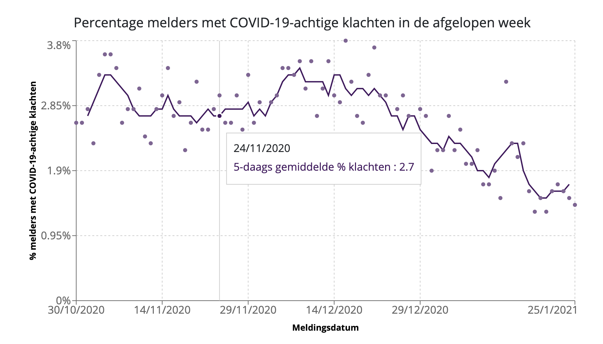

# Results Page

This document contains information about how to create page content for the results page.

## Markdown Flavors

Currently, the following renderers are available for selection:

- **default:** rendering standard markdowns, with one custom renderer for inline code.
- **chartRenderer:** extending the default renderer for custom syntax for Map Charts and Composed Line and Scatter chart.

### Custom Inline Code Renderer

Inline code syntax
```
`This page has been last updated at 02.feb.2021 16:00.`
```

This will be rendered as:



## Map Chart

This component can be used to display spatially distributed data that changes over time. With the tabs, you can select different data sources.
For example:



### Data Format
To configure this mapchart, two JSON files are required:
1. Geo Data file
2. Time Series and Chart Config

#### Geo Data
This file defines the static map part, including also the geometries, and projection properties.
The file needs to contain following attributes:

- **size**: define the size of the svg object for the map - aspect ratio will be kept during page resize.
  - **width** [number]: width of the svg object
  - **height** [number]: height of the svg object
- **projection**:
  - **rotate** [array<number>]: three numbers that define the map's center (rotation) - currently geoAzimuthalEqualArea from the d3 library is used as a projection method.
  - **scale** [number]: controls the zoom attribute for the map. Increase value to "go closer" or decrease to zoom out.
- **topojson**: topojson format defining the geometries that will be drawn on the map. Geometry object will be referenced through their "name" attribute. For assigning values to a specific geometry, the name has to match one to one, case-sensitive.


#### Time Series and Chart Config
This files defines the time series data to be visualized over the maps.
Following attributes needs to be included:

- **slider**:
  - **minLabel** [string]: label used at the left bottom part of the slider
  - **maxLabel** [string]: label used at the right bottom part of the slider
  - **hideTicks** [boolean]: if to show tick markers (grey ticks) for the map
  - **labels** [array of strings]: List of labels, displayed above the slider when a particular index is selected. This list defines as well how many ticks will be generated. It must not contain more values than any of the sequences for the `series[i].data[j].sequence` arrays, otherwise index can point out of bounds.
- **series** [array]: list of objects, defining the time series values and visualisation properties (e.g., color scale). For each series a tab will be created in the same order, as they appear in the list.
  - **name** [string]: this will be used for the tab button, typically a very short but human readable text.
  - **title** [string]: title that appear on top of the map (belore the navigation tabs).
  - **colorScale** [object]: for the color scales the `scaleQuantize` method of d3-scales is used.
    - **min** [number]: minimum value of the color scale.
    - **max** [number]: maximum value of the color scale.
    - **hoverStrokeColor** [string]: color code to be used for the geometry border when in "hovered" state.
    - **colors** [array of strings]: list of color codes that define the stops of the color scale between min and max.
  - **legend**:
    - **show** [boolean]: true/false - if to show the color scale legend
    - **title** [string]: title for the legend component
    - **position**: positioning of the legend over the map on big screens (on small screens it will be stacked on top of the map)
      - **x** ["left" | "right"]: horizontal positioning
      - **x** ["top" | "bottom"]: vertical positioning
  - **data** [array]: data points for each geometry. Each entry in the array needs to contain:
    - **name** [string]: Name of the geometry these values are referenced to. Must be exactly the same as used in the topojson definition.
    - **sequence** [array of nubmers]: array of the datapoints. Numeric values. Should contain at least that many items, as there are possible slider values. (Will be selected by index, based on the slider's position.)


### Add as page item

This component can be added as an individual page item (not localizable then, for localization support include it through a localized markdown).

To include, use a page item with a config:

```
"config": {
  "type": "mapDataSeries",
  "mapUrl": "<relative or absolute path to the geo data json>",
  "dataUrl": "<relative or absolute path to the time series data json>"
}
```

Relative pathes are interpreted using the "content root URL" as a base.

### Add from markdown
To reference (include) such a map chart from a markdown, you can use the following definition syntax:

```
[mapchart:/results/ggd-map-nl.json]:  /results/20210126_0801_kaart_data.json
```

The markdown page item needs to use the flavor type `chartRenderer`.

The json file for the geo data is referenced through the first filename (inside the brackets behind 'mapchart:').

The json file containing the style definitions and time series data, is defined in the url part of the definition behind the brackets (as seen in the above example).

Relative URLs are interpreted using the "content root url" as a base. Optionally, this would also accept absolute URLs starting with "https://" as well.

## Composed Line and Scatter Chart

This component can be used to display a time series as a line or scatter plot, or as a combination, like in this example:




### Data Format
Data and configuration for this chart can be defined through a single JSON file, with the following structure:

```
{
  "propeties": { ... },
  "series": [ {...}, ... ]
}
```

- **properties** object containing the chart configurations. Follow attributes are required:
  - **title** [string]: Title text above the chart.
  - **yUnit** [string]:
  - **yLabel** [string]:
  - **xLabel** [string]:
  - **dateToUnixTsFactor** [number]

- **series** array with the data series that should be displayed. Each entry should be an object with the following attributes:
  - **config** [object]: config for this particular series
    - **type** ["scatter" | "line"]: display type for the series. Currently supported: scatter (dots) or line.
    - **name** [string]: Name of the data series, that will be used in the legend (popup on hover).
    - **color** [string]: line or dot color. Using hex color codes.
  - **data** [array]: Each entry should be an object with the following attributes:
    - **date** [number]: numeric date value. This value multiplied by the `dateToUnixTsFactor` value from the properties should result in the posix timestamp value (seconds since 1970).
    - **value** [number]: numeric value for the y axis.


### Add as page item

This component can be added as an individual page item (not localizable then, for localization support include it through a localized markdown).

To include, use a page item with a config:

```
"config": {
  "type": "lineWithScatterChart",
  "dataUrl": "<relative or absolute path to the data json>"
}
```

Relative pathes are interpreted using the "content root URL" as a base.

### Add from markdown
To reference (include) such a composed chart from a markdown, you can use the following definition syntax:

```
[line-and-scatter-chart]: /results/20210126_0801_percentage_klachten_over_tijd.json
```

The markdown page item needs to use the flavor type `chartRenderer`.

The URL can be relative to the "content root url" or absolute pathes starting with "https//:"
